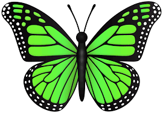
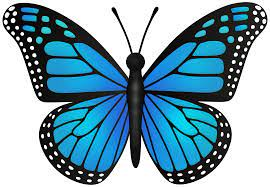
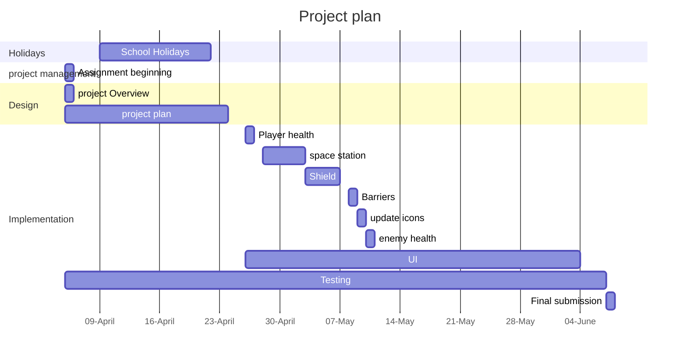

# Project overview

This game is a space invaders clone with a theme of humans vs space butterflys. in the game the player is also tasked with defending a space staion from space butterflys. 

The game is designed to add an extra level of complexity to the normal space invaders experience. As well as making it different from the original game. 

## New gameplay: 

### enemy types:
Although different enemy types is not new to space invaders. the types of enemys themselves are different.

- the basic, green butterfly - it does 1 damage and has 1 Hit Point. 
- the moderate, blue butterfly - it does 3 damage and has 2 Hit points.
- the dangerous red butterfly - it does 5 damage and has 4 Hit points. 

Enemy 1:

Enemy 2:

Enemy 3:
.jpeg)

### The shield: 
Another new feature in this version of space invaders is the sheild that can be placed right in front of you at any time and will block all bullets including your own. It will only be up for 5 seconds and it will have a cooldown timer of 15 seconds. the shield will be used mainly to protect the space station however it can be used to protect the player. 

### Space Station:
The space station will be another point that the player has to defend. it will be positioned at the bottom middle of the screen. the enemies win if they destroy you or the space station. however the enemies will not target the space station. they will shoot at the same speed with the same amount of time each shot. however the enemies will shoot fast enough that there is a good chance the enemies will hit both the player and the space station. the
 space station will be have 3 hit points. 

# Behaviour - User journey

# Planning diagram - Project plan

