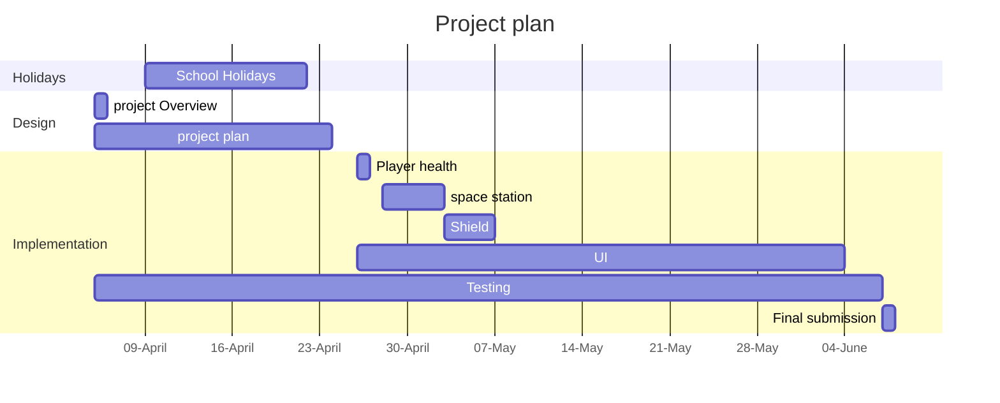

# Project overview

This game is a space invaders clone with a theme of humans vs space butterflys. in the game the player is also tasked with defending a space staion from space butterflys. 

The game is designed to add an extra level of complexity to the normal space invaders experience. As well as making it different from the original game. 

## New gameplay: 

### enemy types:
Although different enemy types is not new to space invaders. the types of enemys themselves are different.

- the basic, green butterfly - it does 1 damage and has 1 Hit Point. 
- the moderate, blue butterfly - it does 3 damage and has 2 Hit points.
- the dangerous red butterfly - it does 5 damage and has 4 Hit points. 

Enemy 1:

Enemy 2:

Enemy 3:
.jpeg)

### The shield: 

### Space Station:
the space station will be another thing that the player has to defend. 

# Behaviour - User journey

# Planning diagram - Project plan

