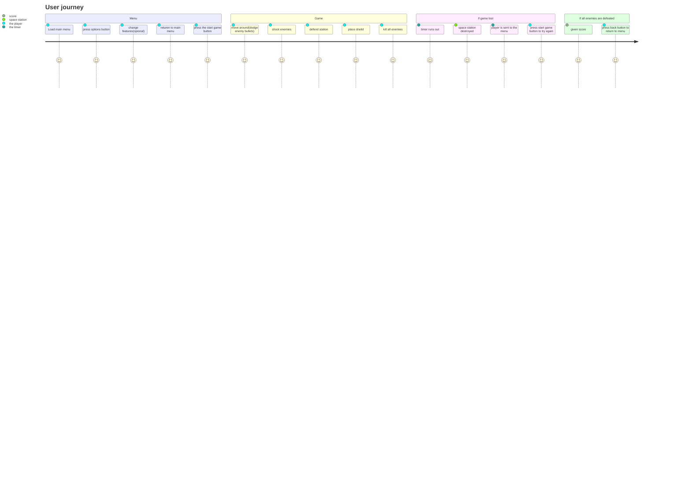
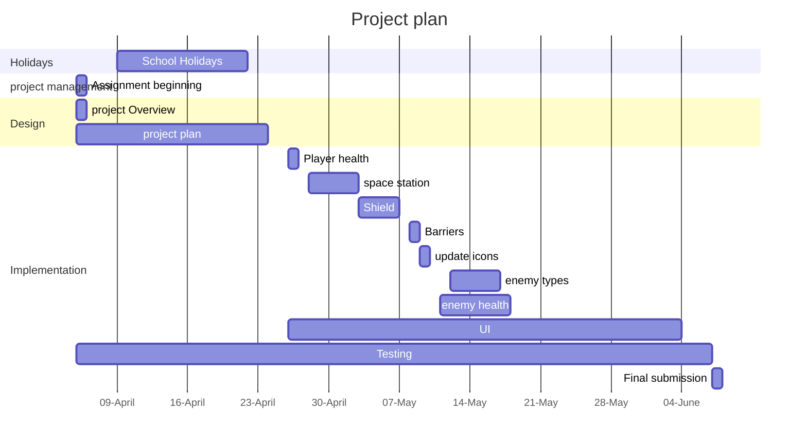

# Project overview

This game is a space invaders clone with a theme of humans vs space butterflys. in the game the player is also tasked with defending a space staion from space butterflys. 

The game is designed to add an extra level of complexity to the normal space invaders experience. As well as making it different from the original game. 

## New gameplay: 

### enemy types:
Although different enemy types is not new to space invaders. the types of enemys themselves are different.

- the basic, green butterfly - it has 1 Hit Point. 
- the dangerous red butterfly - it has 3 Hit points. 

Enemy 1:

Enemy 2:
.jpeg)

(notes): The player will only have 1 hit point and will be one shotted by all enemies. 

### Space Station:
The space station will be the other point that the player has to defend. it will be positioned at the bottom middle of the screen. the enemies win if they destroy you or the space station. however the enemies will not target the space station. they will shoot at the same speed with the same amount of time each shot. however the enemies will shoot fast enough that there is a good chance the enemies will hit both the player and the space station. the
 space station will be have 5 hit points. 

# Behaviour - User journey

# Planning diagram - Project plan

